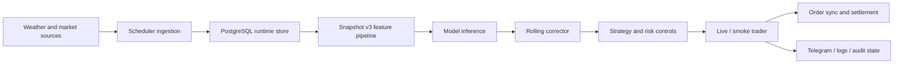

# Michael Liu

I build production-minded AI and data systems that turn real-world data into automated decisions.

My strongest work sits at the intersection of data ingestion, ML inference, backend automation, monitoring, and delivery. I care about systems that do more than run in a notebook: they collect data, make decisions, expose APIs, track failures, and operate with deployment/runtime boundaries.

## Featured Systems

### Polymarket Weather Market Intelligence & Live Trading System

End-to-end weather-market prediction and execution system for same-day temperature markets.

The system collects official weather and market inputs, builds canonical prediction snapshots, serves model inference, applies online correction, and runs live/smoke trading flows with risk controls, order synchronization, settlement checks, and Dockerized runtime services.

**What I built**

- Designed a same-day weather market pipeline around canonical `snapshot_v3` training/serving semantics.
- Built backend runtime services with FastAPI health/readiness endpoints, scheduler startup, PostgreSQL storage, and Docker Compose deployment.
- Implemented live trading components including order management, order sync, settlement checks, risk guardian logic, production/smoke storage, and dry-run support.
- Added a lightweight online corrector trained from recent smoke decisions using a rolling 15-day window, without retraining the main model.
- Created investigation and validation tooling for source latency, market divergence, replay checks, and hourly strategy performance.

**Evidence**

- Runtime services: `postgres`, `backend-api`, `scheduler`, `live-smoke`, `live-trader`
- Prediction stack: `LightGBM + CatBoost + XGBoost` blend with shared feature pipeline
- Evaluation window: 49 cities, 365 days, 68,060 rows in hourly performance report
- Operational modes: smoke, dry-run, and production live trading

**Tech**

Python, FastAPI, PostgreSQL, Docker Compose, APScheduler, SQLite runtime state, ML model serving, weather data ingestion, Telegram notifications, trading automation

---

### Congress Trading ML Prediction Service

MLOps prediction service for ranking congressional stock trades by expected 180-day alpha quality.

The system uses a reproducible DVC pipeline to load, clean, feature-engineer, and train an AutoGluon model, then serves predictions through FastAPI with PostgreSQL logging, drift monitoring, and alerting.

**What I built**

- Built a reproducible ML pipeline with DVC stages for data loading, cleaning, feature engineering, and model training.
- Trained an AutoGluon ensemble model and packaged it behind FastAPI prediction endpoints.
- Added PostgreSQL-backed prediction logging, drift history, prediction statistics, and model health checks.
- Implemented scheduled and manual drift detection using input-feature drift plus prediction-distribution drift.
- Containerized the API, training environment, PostgreSQL, and MLflow tracking server with Docker Compose profiles.

**Evidence**

- Training set: 21,390 rows; test set: 5,348 rows
- Feature set: 77 model features
- Best model: `WeightedEnsemble_L3`
- API surface: `/predict`, `/predict/batch`, `/drift/check`, `/drift/history`, `/predictions/stats`, `/model/info`, `/validate/accuracy`
- Backtest sample: 703 trades with 68.4% win rate; very-high-confidence slice: 126 trades with 79.7% win rate

**Tech**

Python, FastAPI, AutoGluon, DVC, MLflow, PostgreSQL, Docker Compose, Evidently, APScheduler, Pandas, scikit-learn, Telegram alerts

Repository: [MyInvestGuide](https://github.com/Michael-Full-Stack-Liu/MyInvestGuide)

## Engineering Strengths

- End-to-end data ingestion and pipeline design
- ML training/serving alignment
- Backend APIs for model inference and operational health
- Scheduler-driven automation and production runtime configuration
- Drift monitoring, audit logs, smoke tests, and failure visibility
- Trading and decision-system risk controls
- Dockerized deployment with separate API, scheduler, training, and live worker roles

## What I Am Looking For

Roles where I can build reliable AI/data systems around real-world data, model inference, automation, and operational feedback loops.

Good fits include:

- AI Engineer
- Data Engineer
- Backend Engineer, AI/Data Platform
- MLOps Engineer
- Applied ML Engineer

## Contact

- GitHub: [Michael-Full-Stack-Liu](https://github.com/Michael-Full-Stack-Liu)
- LinkedIn: [michael-liu-21918932a](https://www.linkedin.com/in/michael-liu-21918932a/)
- Email: [liujianzhong8@hotmail.com](mailto:liujianzhong8@hotmail.com)

